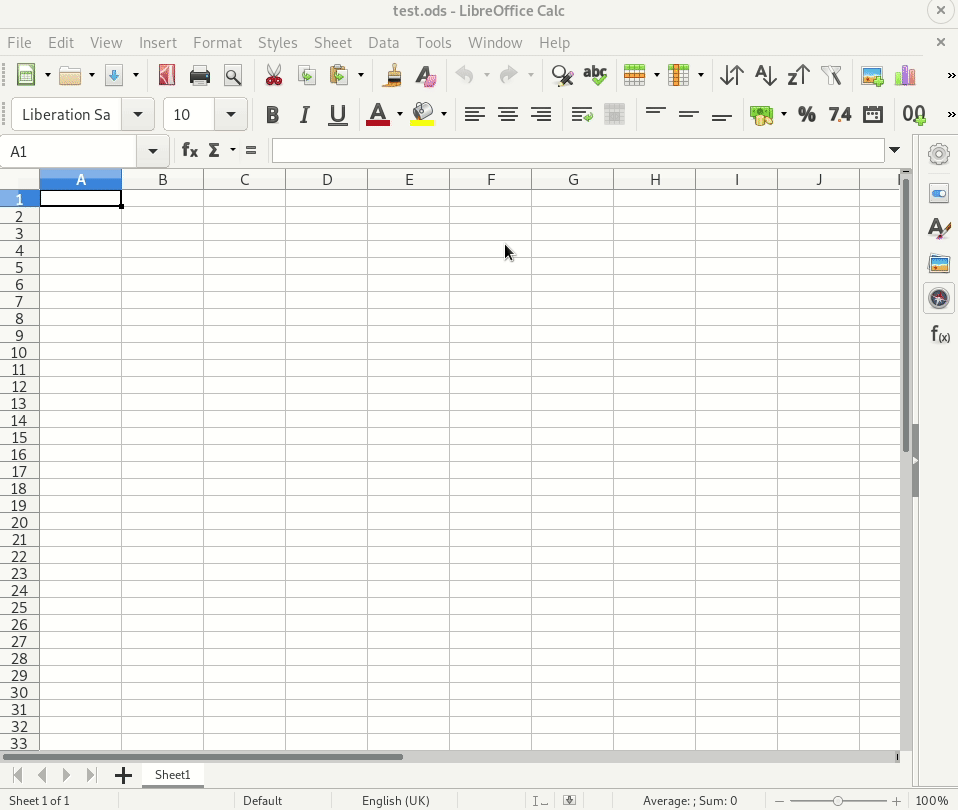
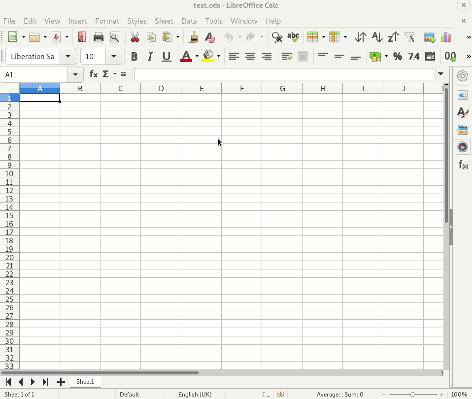
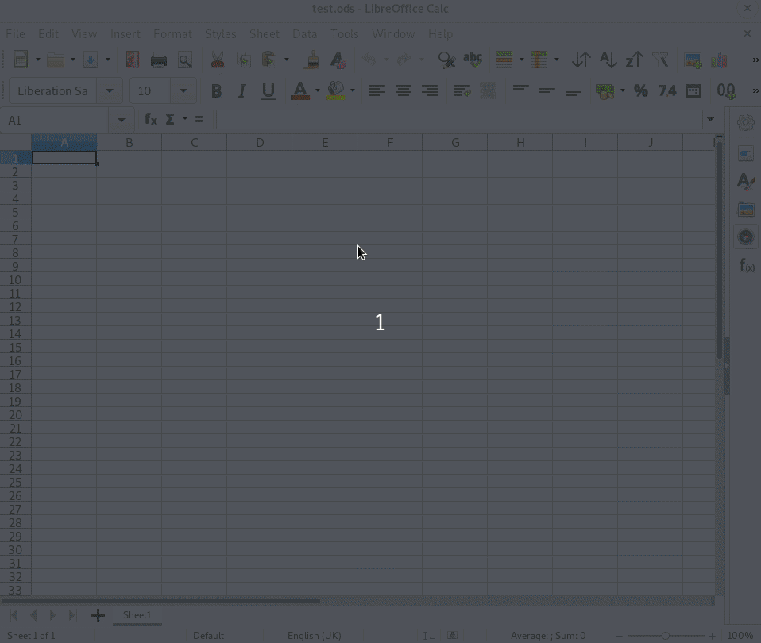
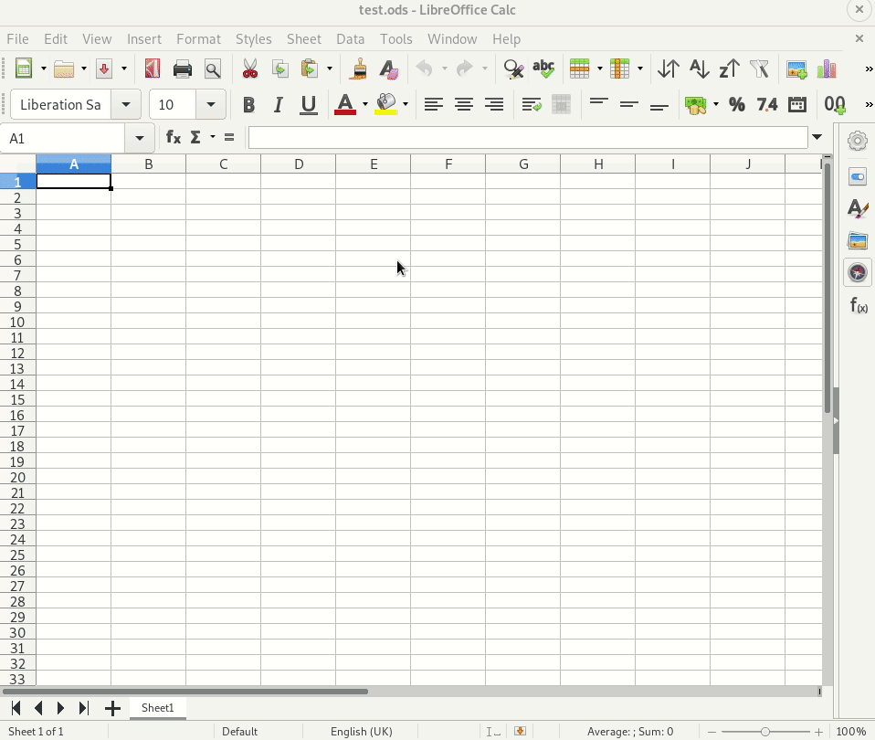
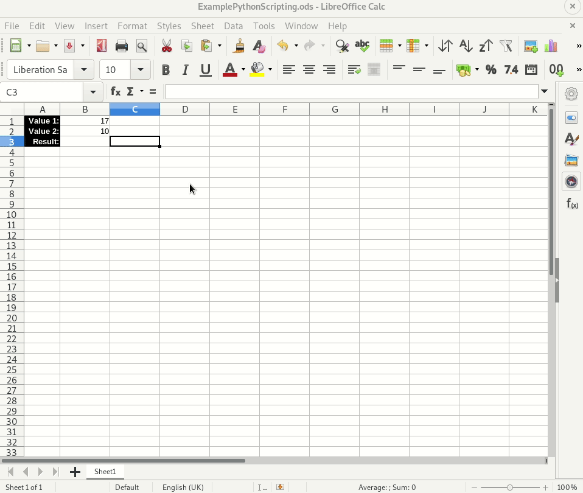
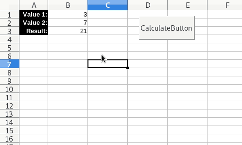

# LibreCalcPythonScripting
This tutorial will show you how to create a basic python script that interacts with a libre office calc spreadsheet using the APSO extension.

This tutorial is based on version 6.3.4.2.0 of Libre Office on Fedora 31.

## Install APSO
APSO (Alternative Script Organizer for Python) Allows us to manage and attach python scripts from within Libre Office.

1. Download the extension from:
 https://extensions.libreoffice.org/extensions/apso-alternative-script-organizer-for-python

 

2. Open Libre Office
3. Tools -> Extension Manager
4. Cick on Add
5. Open the APSO extension(apso.oxt)
6. Click on APSO and press Check for Updates
7. Choose restart now



## Configure Editor
1. Tools -> Extension Manager
2. Select APSO
3. Click on Options
4. Under apso -> EditorKicker -> Editor select your editor

I use Visual Studio Code and 'code' is the name when oppening it from the command line.



## Allow Macros
1. Tools -> Options
2. LibreOffice -> Security
3. Click on 'Macro Security...' button
4. Select Low
5. Click OK button
6. Click Apply button
7. Click OK button

**WARNING**
It is not wise to leave Macro Security on low, it may be ok for a quick test but I would make sure to turn it back afterwards. You could try Medium so it give you an option to run it, but it did not seem to work for me.



## Create a Python Script
Here we will create a python script using APSO and attach it to the current spread sheet we are editing.
1. Tools -> Macros -> Organize python scripts
2. Select the file name and click on Menu -> Create Module
3. Name your Module and press OK
4. Expand the file name and select your module
5. Click Menu -> Edit



We can now edit and save the python script and it will remain attached to the Libre Office Calc file we created.
If you want to make a global script then just create it in one of the other locations.


## Writting A Script
In our script we want to create a function that performs a simple opperation.

Open the script file and you should see the following lines:
```python
# coding: utf-8
from __future__ import unicode_literals
```

Add in the following lines and call the function whatever you want:
```python
# coding: utf-8
from __future__ import unicode_literals
def TestFunction(*args):
    desktop = XSCRIPTCONTEXT.getDesktop()
    model = desktop.getCurrentComponent()
    sheet = model.Sheets.getByIndex(0)
```
The first 2 lines are pretty standard for all scripts and the third gets the sheet that you want to edit. 
There are a few different ways you can get the sheet you want to work on:
* Get by  index `model.Sheets.getByIndex(0)`
* Get by  name `model.Sheets.getByName("Sheet 1")`
* Get by current sheet `model.CurrentController.ActiveSheet`

Now lets get some values from the sheet:
```
cell1 = sheet.getCellRangeByName("B1").Value
cell2 = sheet.getCellRangeByName("B2").Value
```

We can then do something with the values we have taken and then put that back into a cell like so:

```
result = cell1 * cell2
sheet.getCellRangeByName("B3").Value = result
```

The final script will look something like this:

```python
# coding: utf-8
from __future__ import unicode_literals
def TestFunction(*args):
    desktop = XSCRIPTCONTEXT.getDesktop()
    model = desktop.getCurrentComponent()
    sheet = model.Sheets.getByIndex(0)

    cell1 = sheet.getCellRangeByName("B1").Value
    cell2 = sheet.getCellRangeByName("B2").Value

    result = cell1 * cell2

    sheet.getCellRangeByName("B3").Value = result

```

## Add A Button To Run The Script

1. View -> Toolbars -> Form Controls
2. Enable Design mode
3. Click on 'Push Button'
4. Drag out The button
5. Right click on the button and select 'Control Properties...'
6. Rename the button
7. Click on the Events tab
8. Click on the '...' button next to 'Mouse button pressed...'
9. Under Assign Click on 'Macro...'
10. Browse to your script file and select the function you want
11. Click OK and close the properties window.
12. Disable design mode and close the tool bar



You should now be able to click on the button you created to run your script.



You can get the test file I created here:  
[ExamplePythonScripting.ods](ExamplePythonScripting.ods)